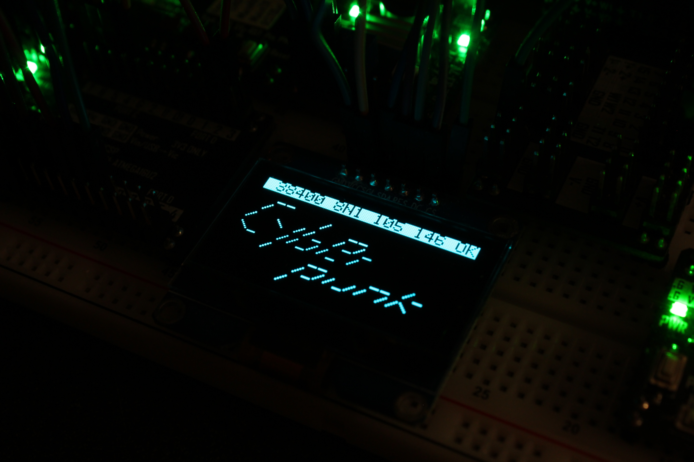

# Mini Terminal

An embedded development tool (hardware) that monitors UART communication. 

The final product of this project will be a PCBA that's part of my Breadboard Module series. The hardware is based around an STM32F103CBT6 MCU and an 1.54 inch OLED display. I'm using ST's HAL and Cube ecosystem for firmware, but will write my own graphic library for the display. 

Both the hardware and firmware development are still in progress, only the concept demo firmware provides some basic functionality. 

This is my first "proper" opensource project, BTW, so there might still be issues with how everything is set up, documentation, and other aspects I don't know how to best handle yet. 

Concept Demo: 

